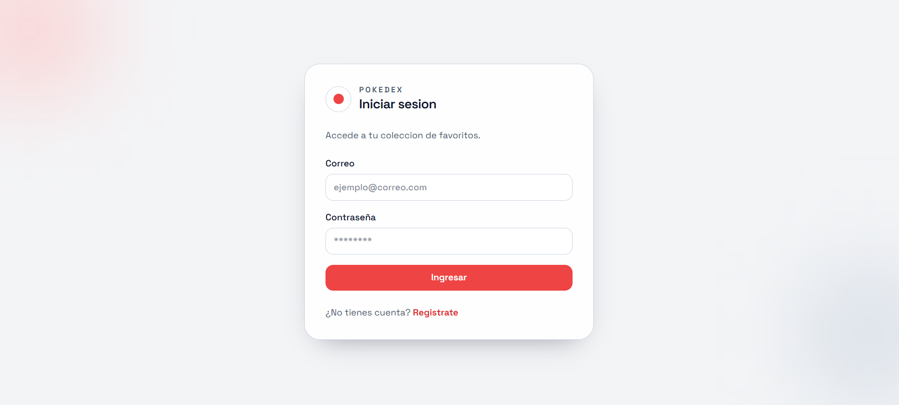
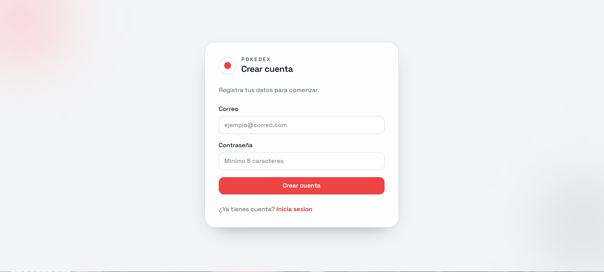
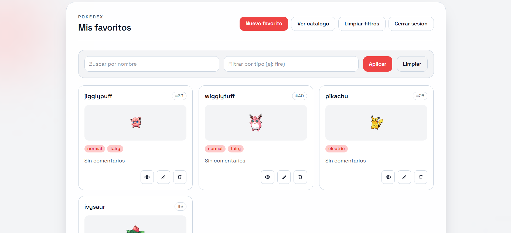
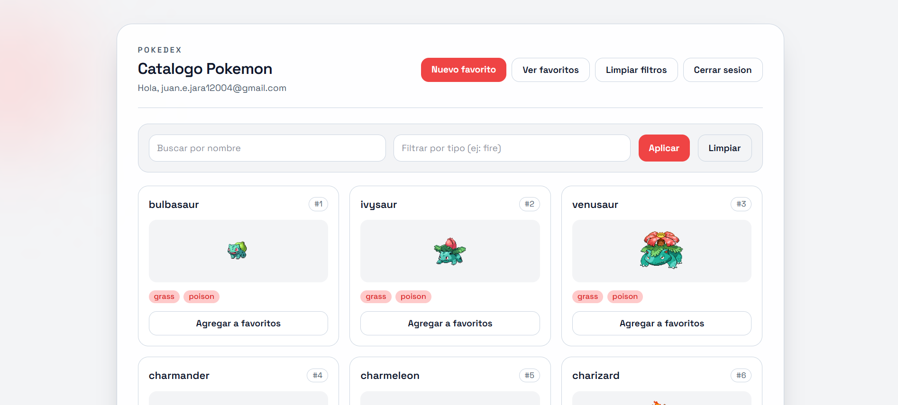
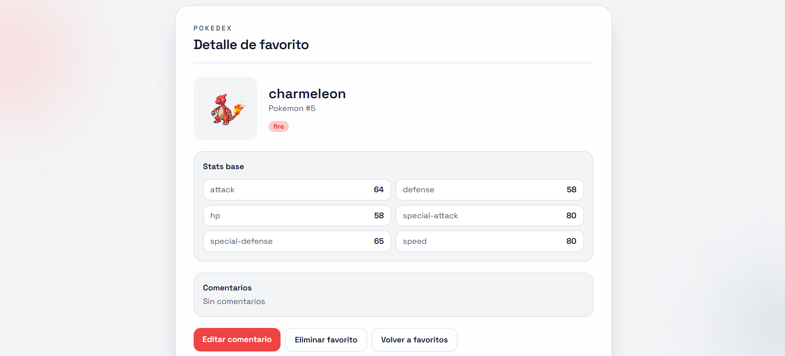
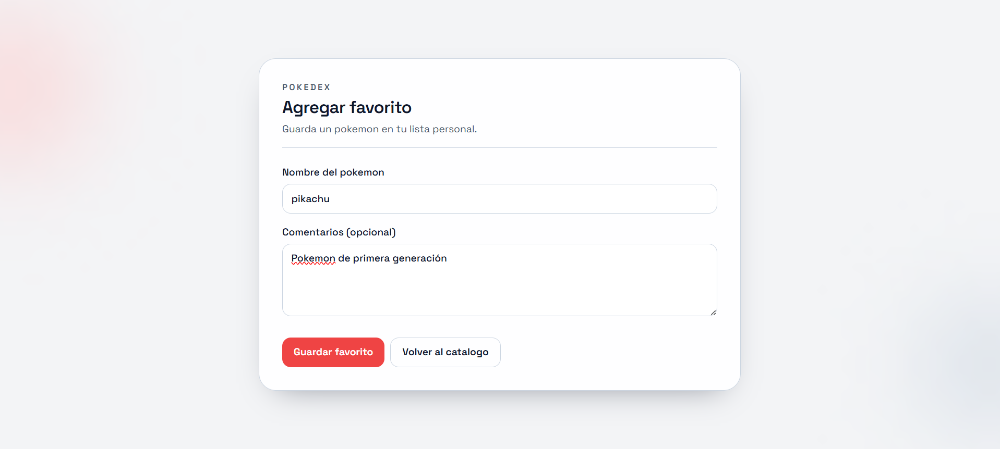
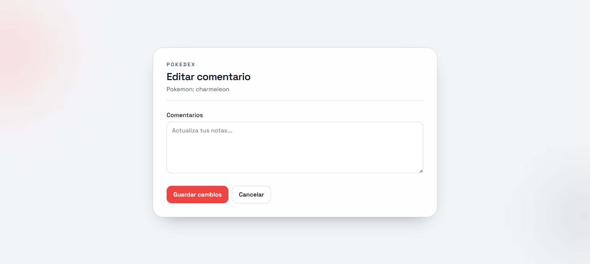

# Poke App - Prueba Tecnica

### Desarrollado por: Juan Eduardo Jaramillo

Monorepo con una aplicacion full-stack para gestionar Pokemon favoritos:
- Backend: NestJS + Prisma + SQLite + JWT
- Frontend: React + TypeScript + Vite
- Integracion externa: PokeAPI (`https://pokeapi.co/api/v2/pokemon`)

## 1. Descripcion General

Este proyecto implementa:
- Autenticacion de usuarios (registro/login) con JWT
- CRUD de Pokemon favoritos
- Integracion de catalogo de Pokemon desde PokeAPI
- Cache persistente de datos Pokemon para reducir llamadas externas
- Busqueda/filtros y paginacion (maximo 20 por pagina)

## 2. Estructura del Repositorio

```text
poke-app/
  backend/      # API NestJS
  frontend/     # Cliente React
  Prueba tecnica.md
```

## 3. Stack Tecnologico

### Backend
- NestJS
- Prisma ORM
- SQLite
- JWT (Passport)
- class-validator / class-transformer

### Frontend
- React + TypeScript
- React Router
- React Hook Form
- Axios
- Sonner (notificaciones/mensajes emergentes)

## 4. Prerrequisitos

- Node.js 20+ (recomendado)
- npm 10+

## 5. Variables de Entorno

Crea `backend/.env` con:

```env
DATABASE_URL="file:./dev.db"
JWT_SECRET="reemplaza_por_un_secreto_seguro"
JWT_EXPIRES_IN_SECONDS=3600
PORT=3000
FRONTEND_URL="http://localhost:5173"
```

Crea `frontend/.env` con:

```env
VITE_API_URL="http://localhost:3000"
```

## 6. Instalacion

### Backend

```bash
cd backend
npm install
npx prisma generate
npx prisma migrate dev --name init
```

### Frontend

```bash
cd frontend
npm install
```

## 7. Ejecucion del Proyecto

Abre dos terminales.

### Terminal 1 - Backend

```bash
cd backend
npm run start:dev
```

Base URL de la API: `http://localhost:3000`

### Terminal 2 - Frontend

```bash
cd frontend
npm run dev
```

URL de la aplicacion: `http://localhost:5173`

## 8. Scripts Disponibles

### Backend (`backend/package.json`)

```bash
npm run start
npm run start:dev
npm run start:prod
npm run build
npm run lint
```

### Frontend (`frontend/package.json`)

```bash
npm run dev
npm run build
npm run preview
npm run lint
```

## 9. Endpoints de la API

### Auth
- `POST /auth/register`
- `POST /auth/login`

### Pokemon Favoritos
- `GET /pokemon` (lista paginada de favoritos)
- `GET /pokemon/:id` (detalle de favorito)
- `POST /pokemon` (agregar favorito)
- `PUT /pokemon/:id` (actualizar comentarios)
- `DELETE /pokemon/:id` (eliminar favorito)

### Catalogo
- `GET /pokemon/catalog` (catalogo paginado desde cache/PokeAPI)

> Nota: las rutas de Pokemon estan protegidas con JWT.

## 10. Ejemplos de uso de la API

### Registro

```bash
curl -X POST http://localhost:3000/auth/register \
  -H "Content-Type: application/json" \
  -d '{"email":"user@test.com","password":"Abcdef1!"}'
```

Respuesta esperada (201):

```json
{
  "id": 1,
  "email": "user@test.com",
  "createdAt": "2026-04-06T01:00:00.000Z",
  "updatedAt": "2026-04-06T01:00:00.000Z"
}
```

### Login

```bash
curl -X POST http://localhost:3000/auth/login \
  -H "Content-Type: application/json" \
  -d '{"email":"user@test.com","password":"Abcdef1!"}'
```

Respuesta esperada (200):

```json
{
  "access_token": "<JWT_TOKEN>",
  "token_type": "Bearer"
}
```

### Listar catalogo

```bash
curl -X GET "http://localhost:3000/pokemon/catalog?page=1&limit=20" \
  -H "Authorization: Bearer <JWT_TOKEN>"
```

### Crear favorito

```bash
curl -X POST http://localhost:3000/pokemon \
  -H "Content-Type: application/json" \
  -H "Authorization: Bearer <JWT_TOKEN>" \
  -d '{"name":"pikachu","comments":"Mi favorito"}'
```

### Actualizar favorito

```bash
curl -X PUT http://localhost:3000/pokemon/1 \
  -H "Content-Type: application/json" \
  -H "Authorization: Bearer <JWT_TOKEN>" \
  -d '{"comments":"Comentario actualizado"}'
```

### Eliminar favorito

```bash
curl -X DELETE http://localhost:3000/pokemon/1 \
  -H "Authorization: Bearer <JWT_TOKEN>"
```

## 11. Capturas de pantalla de la UI

Espacio reservado para evidencias visuales de la aplicacion.

- Login

- Register

- Dashboard (Favoritos)

- Catalogo

- Detalle de Favorito

- Crear Favorito

- Editar Favorito


## 12. Colecciones de Postman

Se incluyen archivos listos para importar desde la carpeta [postman](postman):

- [postman/PokeAppAPI.postman_collection.json](postman/PokeAppAPI.postman_collection.json)
- [postman/PokeAppLocal.postman_environment.json](postman/PokeAppLocal.postman_environment.json)

### Que contiene la coleccion

- Auth:
  - Register
  - Login
- Pokemon Catalog:
  - List Catalog
- Favorite Pokemon:
  - List Favorites
  - Create Favorite
  - Get Favorite By Id
  - Update Favorite
  - Delete Favorite

### Que contiene el environment

- `baseUrl`: URL base de la API (default: `http://localhost:3000`)
- `email`: correo para pruebas
- `password`: contrasena para pruebas
- `token`: JWT
- `favoriteId`: ID del favorito creado
- `pokemonName`: nombre del Pokemon para crear favorito
- `comments`: comentario inicial
- `page`, `limit`, `search`, `type`: parametros de listado

### Como importar en Postman

1. Abre Postman.
2. Haz clic en `Import`.
3. Importa [postman/PokeAppAPI.postman_collection.json](postman/PokeAppAPI.postman_collection.json).
4. Importa [postman/PokeAppLocal.postman_environment.json](postman/PokeAppLocal.postman_environment.json).
5. Selecciona el environment `Poke App Local`.

### Flujo recomendado de ejecucion

1. `Auth -> Register`
2. `Auth -> Login` (guarda `token`)
3. `Pokemon Catalog -> List Catalog`
4. `Favorite Pokemon -> Create Favorite` (guarda `favoriteId`)
5. `Favorite Pokemon -> Get Favorite By Id`
6. `Favorite Pokemon -> Update Favorite`
7. `Favorite Pokemon -> Delete Favorite`

## 13. Revisar Base de Datos (tablas y registros)

### Ver tablas y registros en interfaz grafica

Abre una terminal en la carpeta `backend` y ejecuta:

```bash
npx prisma studio
```

Se abrira Prisma Studio en el navegador y podras navegar tabla por tabla.

### Ver tablas y registros (terminal)

En `backend`, abre SQLite sobre el archivo de Prisma:

```bash
sqlite3 prisma/dev.db
```

Luego ejecuta:

```sql
.tables
SELECT name FROM sqlite_master WHERE type='table' ORDER BY name;
SELECT * FROM User;
SELECT * FROM FavoritePokemon;
SELECT * FROM PokemonCache;
```

Para salir:

```bash
.exit
```
